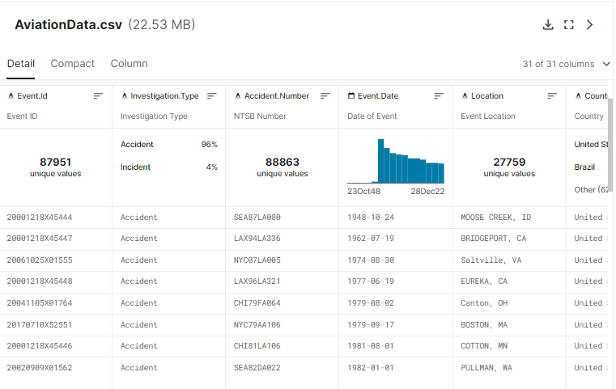
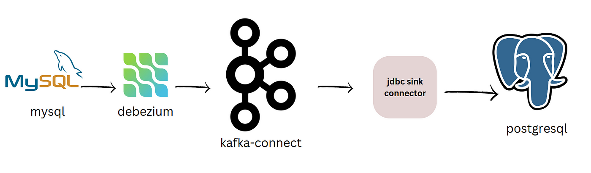

# PROJECT KAFKA - CDELACRUZ

## Dataset

The **Aviation Accident** dataset will be used for implementing a pipeline using kafka and other tools.

The total size of the dataset is: **22.53 MB**  
The total columns to use are: **30 columns**  


**Observations:**  

Aviation Accident:           

                    61% of the records of 'Latitude' are null.   
                    61% of the records of 'Longitude' are null.  
                    64% of the records of 'FAR.Description' are null.
                    86% of the records of 'Schedule' are null.  
                    81% of the records of 'Air.Carrier' are null.
 

For this pipeline we are using a total of: **97,405** records that will be sent from csv to postgres.


Link: [https://www.kaggle.com/datasets/khsamaha/aviation-accident-database-synopses]





## Architeture of the Pipeline
The Pipeline was created with docker using different containers:
   
Zookeeper   
Kafka  
Debiezum    
Mysql   
Postgres SQL    
Adminer

Check the file docker-compose.yaml for more Details.




## Reading source

The Spark Session was defined as: 

```scala
lazy val spark: SparkSession = SparkSession
                              .builder
                              .appName("BigDataKafka")
                              .master("local[*]")
                              //to fix issue of port assignment on local
                              .config("spark.driver.bindAddress", "localhost")
                              .getOrCreate()
```


## How the Dataset is processed

### Producer.scala

The objective of this object is to read the selected dataset with the functions that we have previously created. And typify the information according to the type of data in each of the columns: 
```scala
//file name with path
val fileName = "src/main/resources/dataset/AviationData.csv"

//Kafka input topic name
val topicName = "csv_to_mysql"

//Dropping the column names
for (line <- Source.fromFile(fileName).getLines().drop(1)){}
```


### ReadingProducer.scala

The objective of this object is to read the selected dataset that is currently in a topic from kafka and insert into mysql leaning us with spark streaming:

The first one, is reading the csv from a specific topic.

```scala
  val transformDF_1 = spark.readStream
                    .format("kafka")
                    .option("kafka.bootstrap.servers", KafkaReaderConfig_1.kafkaBootstrapServers)
                    .option("subscribe", KafkaReaderConfig_1.topics)
                    .option("startingOffsets", KafkaReaderConfig_1.startingOffsets)
                    .option("failOnDataLoss", "false")
                    .load().selectExpr("CAST(key AS STRING) as key", "CAST(value AS STRING) as value", "topic")
```

The second one, take the columns depends on the structure of the file.

```scala
val transformDF_2 = transformDF_1.select(
  split(col("value"), ",").getItem(0).as("event_id"),
  split(col("value"), ",").getItem(1).as("investigation_type"),
  split(col("value"), ",").getItem(2).as("accident_number"),
  split(col("value"), ",").getItem(3).as("event_date"),
  split(col("value"), ",").getItem(4).as("location_city"),
  split(col("value"), ",").getItem(5).as("location_state"),
  split(col("value"), ",").getItem(6).as("country"),
  split(col("value"), ",").getItem(7).as("latitude"),
  split(col("value"), ",").getItem(8).as("longitude"),
  split(col("value"), ",").getItem(9).as("airport_code"),
  split(col("value"), ",").getItem(10).as("airport_name"),
  split(col("value"), ",").getItem(11).as("injury_severity"),
  split(col("value"), ",").getItem(12).as("aircraft_damage"),
  split(col("value"), ",").getItem(13).as("aircraft_category"),
  split(col("value"), ",").getItem(14).as("registration_number"),
  split(col("value"), ",").getItem(15).as("make"),
  split(col("value"), ",").getItem(16).as("model"),
  split(col("value"), ",").getItem(17).as("amateur_built"),
  split(col("value"), ",").getItem(18).as("number_of_engines"),
  split(col("value"), ",").getItem(19).as("engine_type"),
  split(col("value"), ",").getItem(20).as("far_description"),
  split(col("value"), ",").getItem(21).as("schedule"),
  split(col("value"), ",").getItem(22).as("purpose_of_flight"),
  split(col("value"), ",").getItem(23).as("air_carrier"),
  split(col("value"), ",").getItem(24).as("total_fatal_injuries"),
  split(col("value"), ",").getItem(25).as("total_serious_injuries"),
  split(col("value"), ",").getItem(26).as("total_minor_injuries"),
  split(col("value"), ",").getItem(27).as("total_uninjured"),
  split(col("value"), ",").getItem(28).as("weather_condition"),
  split(col("value"), ",").getItem(29).as("broad_phase_of_flight"),
  split(col("value"), ",").getItem(30).as("report_status"),
  split(col("value"), ",").getItem(31).as("publication_date")
)
```

The third one, store the data into mysql that was taken from kafka topic.

```scala
transformDF_2
  .writeStream
  .option("checkpointLocation", checkpointLocation)
  .foreachBatch { (batchDF: DataFrame, _: Long) => {
    batchDF
      .write
      .format("jdbc")
      .option("url", JDBCConfig_1.url)
      .option("user", JDBCConfig_1.user)
      .option("password", JDBCConfig_1.password)
      .option("driver", "com.mysql.jdbc.Driver")
      .option(JDBCOptions.JDBC_TABLE_NAME, JDBCConfig_1.tableName)
      //.option("StringType", "unspecified")
      .mode(SaveMode.Append)
      .save()
  }
  }.start()
  .awaitTermination()
```


### StreamingJob.scala
Inside of this file we'll find the code used for moving the data from mysql to postgres leaning us with Kafka and Spark Streaming.


The first one, is reading the csv from a specific topic.

```scala
val transformDF_1 = read().selectExpr("CAST(key AS STRING) as key", "CAST(value AS STRING) as value", "topic")
```

The second one, is reading the value with the specific format that was sent through debezium.

```scala
val transformDF_2 = transformDF_1.select(get_json_object(col("value"), "$.payload").alias("payload"))
val transformDF_3 = transformDF_2.select(get_json_object(col("payload"), "$.after").alias("after"))
val transformDF = transformDF_3.withColumn("data", from_json(col("after"), schema)).select("data.*")
```


The third one, store the segmented data into Postgres SQL that was taken from kafka topic.

```scala
  transformDF
  .writeStream
  .option("checkpointLocation", checkpointLocation)
  .foreachBatch { (batchDF: DataFrame, _: Long) => {
    val df_1 = batchDF.select(
      col("event_date").cast(TimestampType),
      col("investigation_type").cast(StringType),
      col("location_city").cast(StringType),
      col("location_state").cast(StringType),
      col("country").cast(StringType),
      col("airport_code").cast(StringType),
      col("airport_name").cast(StringType),
      col("injury_severity").cast(StringType),
      col("total_fatal_injuries").cast(IntegerType),
      col("total_serious_injuries").cast(IntegerType),
      col("total_minor_injuries").cast(IntegerType),
      col("total_uninjured").cast(IntegerType),
      col("weather_condition").cast(StringType),
      col("broad_phase_of_flight").cast(StringType),
      col("report_status").cast(StringType),
    )

    val df_2 = batchDF.select(
      col("event_date").cast(TimestampType),
      col("investigation_type").cast(StringType),
      col("injury_severity").cast(StringType),
      col("total_fatal_injuries").cast(IntegerType),
      col("total_serious_injuries").cast(IntegerType),
      col("total_minor_injuries").cast(IntegerType),
      col("total_uninjured").cast(IntegerType),
      col("aircraft_damage").cast(StringType),
      col("aircraft_category").cast(StringType),
      col("registration_number").cast(StringType),
      col("make").cast(StringType),
      col("model").cast(StringType),
      col("amateur_built").cast(StringType),
      col("number_of_engines").cast(IntegerType),
      col("engine_type").cast(StringType),
      col("purpose_of_flight").cast(StringType),
    )

    df_1
      .write
      .format("jdbc")
      .option("url", jdbcConfig.url)
      .option("user", jdbcConfig.user)
      .option("password", jdbcConfig.password)
      .option("driver", "org.postgresql.Driver")
      .option(JDBCOptions.JDBC_TABLE_NAME, "df_1")
      //.option("StringType", "unspecified")
      .mode(SaveMode.Append)
      .save()

    df_2
      .write
      .format("jdbc")
      .option("url", jdbcConfig.url)
      .option("user", jdbcConfig.user)
      .option("password", jdbcConfig.password)
      .option("driver", "org.postgresql.Driver")
      .option(JDBCOptions.JDBC_TABLE_NAME, "df_2")
      //.option("StringType", "unspecified")
      .mode(SaveMode.Append)
      .save()
  }
  }.start()
  .awaitTermination()
```